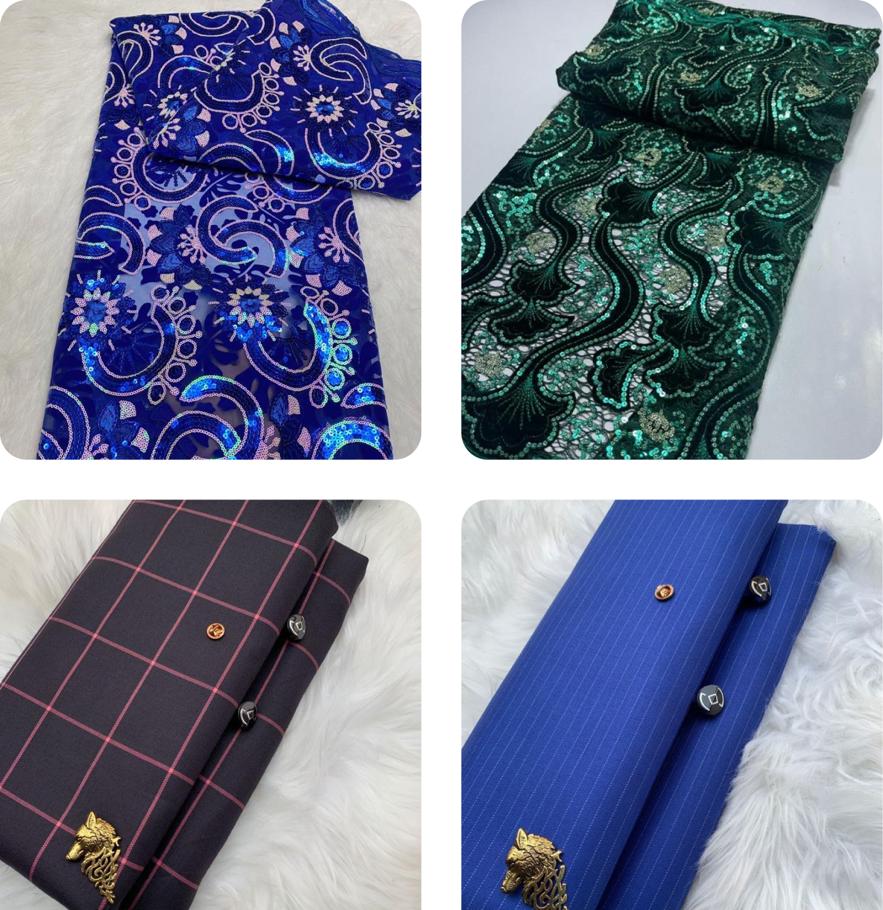

# Original Aso Ebi - Mobile Ecommerce Application

Welcome to the Original Aso Ebi mobile ecommerce application README! Original Aso Ebi is an ecommerce platform specializing in the sale of cloth materials and fabrics. Our mobile application offers users a convenient way to browse, purchase, and track orders for a wide range of fabric products. Whether you're a fashion enthusiast, a tailor, or simply looking for high-quality fabrics, our app provides an intuitive shopping experience tailored to your needs.

## Features

### 1. Browse Products

- Explore a vast catalog of cloth materials and fabrics, categorized for easy navigation.
- View detailed product descriptions, including fabric type, color, size, and price.
- Filter products based on various criteria such as fabric type, color, price range, and more.

### 2. Secure Purchasing

- Add items to your cart and proceed to checkout with a secure payment gateway.
- Choose from multiple payment options, including credit/debit cards, mobile wallets, and cash on delivery.

### 3. Account Management

- Create an account to access order history, track shipments, and manage personal information.
- Receive notifications regarding order updates, promotions, and new product arrivals.

### 4. Wishlist

- Save your favorite fabric products to a wishlist for easy access and future purchases.
- Share your wishlist with friends and family to get their opinions or as a subtle hint for gifts.

### 5. User-Friendly Interface

- Enjoy a visually appealing and user-friendly interface designed for seamless navigation and enhanced shopping experience.
- Access customer support and assistance directly from within the app.

## Installation

### Requirements

- Android or iOS device with minimum supported version requirements.
- Stable internet connection for browsing and purchasing products.

### Installation Steps

1. Download the Original Aso Ebi mobile application from the App Store (iOS) or Google Play Store (Android).
2. Follow the on-screen instructions to install the app on your device.
3. Upon installation, launch the app and sign up or log in to begin exploring and shopping for fabric products.

## Support and Feedback

For any inquiries, feedback, or assistance, please feel free to contact our customer support team at support@originalasoebi.com. We value your feedback and strive to continuously improve our app to provide you with the best shopping experience.

Happy shopping with Original Aso Ebi!

_Original Aso Ebi - Your Destination for Quality Fabric!_
